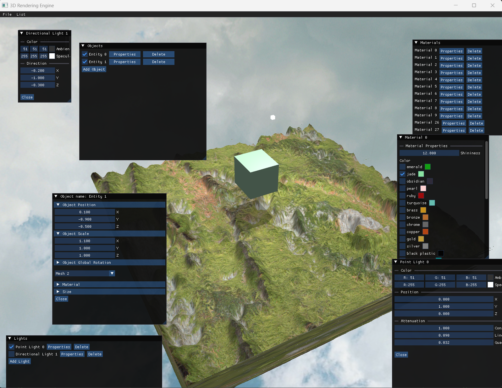
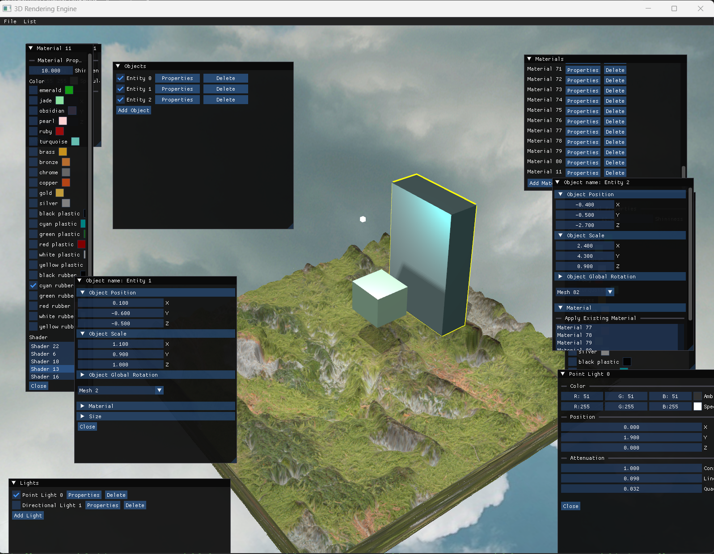

# 3D Rendering Engine
A powerful and feature-rich 3D rendering engine built using C++ and OpenGL. This engine supports material system, scene management, lighting, shadows, model loading, and textures.
You can use GUI to easily manage the objects in the scene.

# Features
Directional Light, Spot Light, and point Light shadows  
Normal/Parallax mapping  
Model loading  
Deferred Rendering  
Screen-Space Ambient Occlusion  
Phasically Based Rendering (In Progress)  

# Screenshots

# Dependencies
Dear ImGui  
stb  
Assimp  
ImGuiFileDialog  
GLFW  
GLM  
GLAD  
